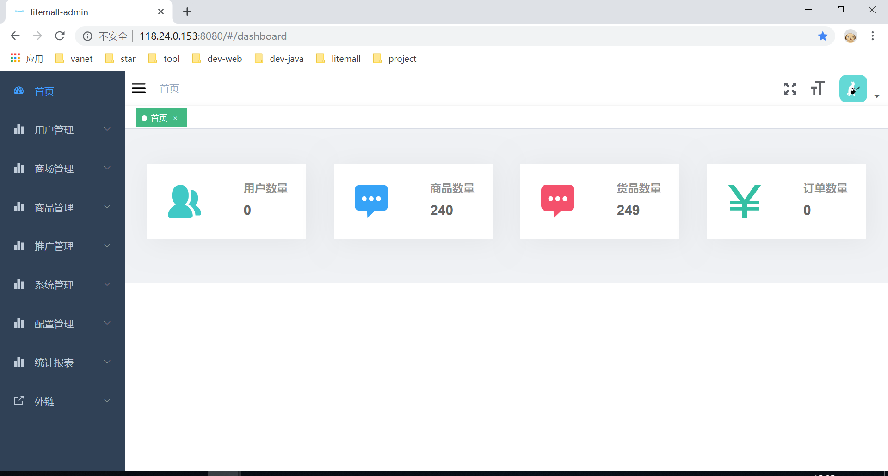

# Litemall

> A little mall system.
> 
> litemall = Spring Boot back-end + Vue admin front-end + WeChat applet user front-end + Vue user mobile-end

* [Documentation](https://linlinjava.gitbook.io/litemall)
* [Contribution](https://linlinjava.gitbook.io/litemall/contribute)
* [FAQ](https://linlinjava.gitbook.io/litemall/faq)
* [API](https://linlinjava.gitbook.io/litemall/api)

## Project examples

### Litemall example

Please scan the following QR code to visit

    

Or the browser uses the mobile phone mode to access the following URL: [http://122.51.199.160:8080/vue/index.html#/](http://122.51.199.160:8080/vue/index.html#/)

Notice: 
> 1. Due to the large amount of data loaded for the first time, it is recommended to access the Wi-Fi network and wait patiently for a few seconds. 
> 2. This example is a test light shopping mall, does not support payment, and it is not perfect in development.

### Management background instance

    

1. Open the browser and enter the following URL: [http://122.51.199.160:8080/#/login](http://122.51.199.160:8080/#/login)
2. The administrator username is `admin123`, and the administrator password is `admin123`
> Note: This example is only a test management background, not the management background of the first two small malls.

## Project Architecture
    

## Technology stack

> 1. Spring Boot
> 2. Vue
> 3. WeChat Mini Program

    

## Functions

### Litemall functions

* Home  
* List of topics, details of the topics  
* Classification list, classification details  
* Brand list, brand details  
* New product launch, popularity recommended  
* Coupon list, coupon selection  
* Group purchase (group purchase business to be improved)  
* Search for  
* Product details, product evaluation, commodity sharing  
* Shopping cart  
* Order  
* Order list, order details  
* Address, collection, footprint, feedback  
* Customer servic

### The management platform features  
 
* Member management  
* Mall Management  
* Commodity management  
* Promotional management  
* System management  
* Configuration management  
* Statistical report

## Quick start  
 
1. Configure the minimum development environment:  
    * [MySQL](https://dev.mysql.com/downloads/mysql/)
    * (http://www.oracle.com/technetwork/java/javase/overview/index.html) (JDK1.8 or above).
    * [Maven](https://maven.apache.org/download.cgi) 
    * [Nodejs](https://nodejs.org/en/download/) 
    WeChat Developer Tool (https://developers.weixin.qq.com/miniprogram/dev/devtools/download.html)  
     
2. The database is imported in turn into the database file under litemall-db/sql 
    * litemall_schema.sql 
    * litemall_table.sql 
    * litemall_data.sql 
 
3. Start a back-end service  
 for small shopping malls and management back office
 
    Open the command line and enter the following command  
    ```bash 
    cd litemall 
    mvn install 
    mvn clean package 
    java -Dfile.encoding=UTF-8 -jar litemall-all/target/litemall-all-0.1.0-exec.jar 
    ``` 
     
4. Start the management background front-end  
 
    Open the command line and enter the following command  
    ```bash 
    npm install -g cnpm --registry=https://registry.npm.taobao.org 
    cd litemall/litemall-admin 
    cnpm install 
    cnpm run dev 
    ``` 
    At this point, the browser opens, enter the URL 'http://localhost:9527', and then goes to the management background login page.  
     
5. Start the small mall front-end  
    
   There are two small store front-end litemall-wx and renard-wx that developers can import and test separately:  
    
   1. WeChat development tools import litemall-wx project;  
   2. Project configuration, enabling the "Uncorrected legitimate domain name, web-view (business domain name), TLS version, and HTTPS certificate"  
   3. Click "Compilation" to preview the effect in WeChat' 
 s development tools;
   4. You can also click "Preview" and the phone scans to log in (but the phone needs to turn on debugging).  
       
   Note:  
   &gt; Here is only the simplest way to start, and small shopping malls WeChat login, WeChat payment and other functions need developer settings to run,  
   &gt; For more detailed scenarios, please refer to the documentation (https://linlinjava.gitbook.io/litemall/project).  
 
6. Start the Light Marketplace front-end  
 
    Open the command line and enter the following command  
    ```bash 
    npm install -g cnpm --registry=https://registry.npm.taobao.org 
    cd litemall/litemall-vue 
    cnpm install 
    cnpm run dev 
    ``` 
    At this point, the browser (recommended in chrome phone mode) opens, enters the URL 'http://localhost:6255', and enters the light mall.  


## License

[MIT](https://github.com/linlinjava/litemall/blob/master/LICENSE)
Copyright (c) 2018-present linlinjava
